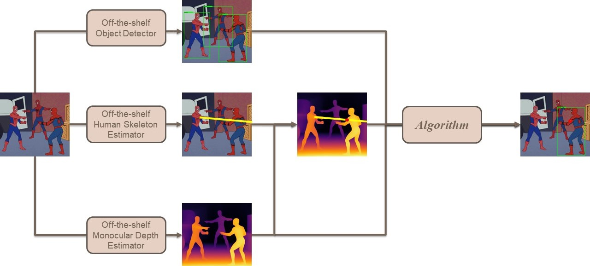

<div align="center">
<h1>PointAnything: Pointing Estimation from single RGB image</h1>

[李宗諺](https://github.com/solocat17)<sup>\*</sup> · [黃仁駿](https://github.com/c98181)<sup>\*</sup> · [劉冠言](https://github.com/star-platinum127)<sup>\*</sup> · [游惠晴](https://github.com/hcyu0101)<sup>\*</sup> 

<sup>\*</sup>Equally contributed

**NYCU AI workshop spring 2024 Best Project Award (among 60+ competitors)**

[Presentation Record Link](https://youtu.be/6Y-3q6fSCmE?si=OojcVHpC_Ku5Uzs2)


</div>

## Abstract



In this project, we developed a zero-shot pointing estimation system capable of identifying the object being pointed to within an image. The system is composed of three components: pointing estimation, depth estimation, and object detection. For each component, we used pre-trained models to estimate the corresponding information. We integrated these three components into a single pipeline to estimate the object being pointed in the image. Eventually, our system achieved an accuracy of approximately 25%. The system holds significant potential for a range of applications, including enhancing human-computer interaction.

## Usage

### Build environments

Make sure that [Anaconda](https://www.anaconda.com/download) is installed in advance.

```bash
# Under the root directory of PointAnything/
bash scripts/build_env/PointAnything.sh
```

The script above will automatically create 3 environments and download 3 pre-trained models.

### Run the project with your own image

```bash
# Under the directory of PointAnything/scripts/inference/
bash Integrated.sh <input_image_in_input_folder> <indices_of_usable_GPUs>
```

The script above takes seconds to minutes to estimate the object being pointed to in the image.
The result will be saved at PointAnything/data/output/<image_name>

## Adaptive Approach Ver 1

[](https://colab.research.google.com/drive/1RHdYxRKBmngfjl5O7syqcQq3rQ7Pxc_L?usp=sharing) 

You can modified the path of image in Run multi section step 2.

## Adaptive Approach Ver 2 and Ver 3

```bash
# Under the root directory of PointAnything/
bash scripts/build_env/PointAnything.sh
```

The script above will automatically create 3 environments and download 3 pre-trained models. Note that due to the complexity of the installation (Including CUDA version, path, and more. There are no general solution for each computer), we do not provide a script to install detectron2. You have to manually install it in the conda environment "yolov10".

### Run the project with your own image

```bash
# Under the directory of PointAnything/scripts/inference_2/
bash Integrated_2.sh <input_image_in_input_folder> <indices_of_usable_GPUs>
```

The script above takes seconds to minutes to estimate the object being pointed to in the image.
The result will be saved at PointAnything/data/output/<image_name>

## Acknowledgement

We sincerely thank [PYSKL](https://github.com/kennymckormick/pyskl), [Depth Anything](https://github.com/LiheYoung/Depth-Anything), [YOLOv10](https://github.com/THU-MIG/yolov10), [SAM](https://github.com/facebookresearch/segment-anything), [Detectron2](https://github.com/facebookresearch/detectron2), and others for providing their wonderful code to the community!
