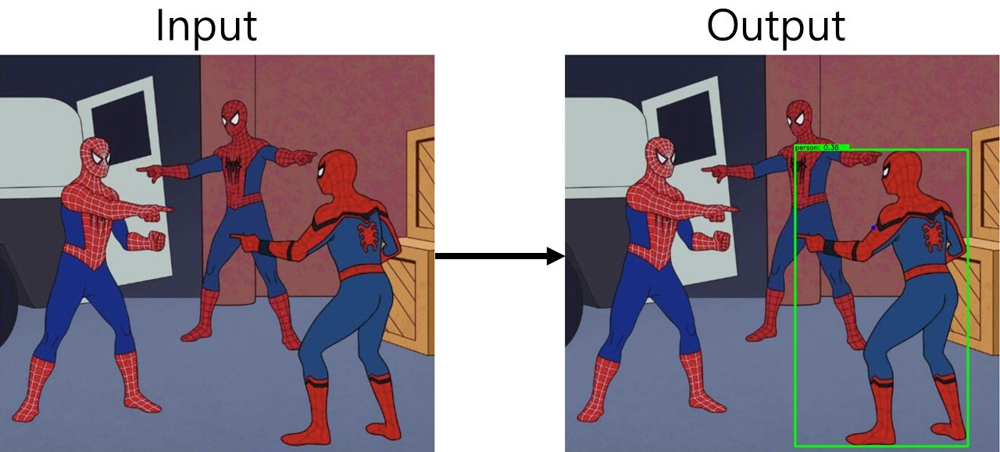

<div align="center">
<h2>PointAnything: Pointing Estimation from single RGB image</h2>

[李宗諺](https://github.com/solocat17)<sup>\*</sup> [黃仁駿](https://github.com/c98181)<sup>\*</sup> [劉冠言](https://github.com/star-platinum127)<sup>\*</sup> [游惠晴](https://github.com/hcyu0101)<sup>\*</sup> 

<sup>\*</sup> Equally contributed

**NYCU AI workshop spring 2024 Best Project (among 60+ competitors)**



</div>

## Usage

### Build environments

Make sure that [Anaconda](https://www.anaconda.com/download) is installed in advance.

```bash
# Under the root directory of PointAnything/
bash scripts/build_env/PointAnything.sh
```

The script above will automatically create 3 environments and download 3 pre-trained models.

### Run the project with your own image

```bash
# Under the directory of PointAnything/scripts/inference/
bash Integrated.sh <input_image_in_input_folder> <index_of_usable_GPUs>
```

The script above takes seconds to minutes to estimate the object being pointed in the image.
The result will be saved at PoinyAnything/data/output/<image_name>
## Adaptive Approach Ver 1
[](https://colab.research.google.com/drive/1RHdYxRKBmngfjl5O7syqcQq3rQ7Pxc_L?usp=sharing) 
You can modified the path of image in Run multi section step 2.
## Adaptive Approach Ver 2 and Ver 3
```bash
# Under the root directory of PointAnything/
bash scripts/build_env/PointAnything.sh
```

The script above will automatically create 3 environments and download 3 pre-trained models. After this, you have to download detectron2 in the conda environment "yolov10", since there are many problems building this package(including CUDA version error and path error and so on, there are no general solution to each computer).

### Run the project with your own image

```bash
# Under the directory of PointAnything/scripts/inference_2/
bash Integrated_2.sh <input_image_in_input_folder> <index_of_usable_GPUs>
```

The script above takes seconds to minutes to estimate the object being pointed in the image.
The result will be saved at PoinyAnything/data/output/<image_name>
## Acknowledgement

We sincerely thank [PYSKL](https://github.com/kennymckormick/pyskl), [Depth Anything](https://github.com/LiheYoung/Depth-Anything), [YOLOv10](https://github.com/THU-MIG/yolov10), and others for providing their wonderful code to the community!

